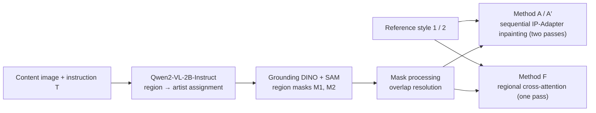

# MLLM-Grounded Multi-Region Artistic Style Transfer with Reference Images

Code and experiment record for the MSc dissertation
**"MLLM-Grounded Multi-Region Artistic Style Transfer with Reference Images"**
(University of Bath, MSc Artificial Intelligence, 2025–2026).

Author: Radha Kumari Ray. Supervisor: Dr Deblina Bhattacharjee.

---

## What this project does

Given a photograph and an instruction such as *"style the sky like Van Gogh and the buildings like Cézanne"*, the pipeline applies a **different reference painting to each named region** in one editing process. It is **training-free**: every stage uses a pretrained model.

The project asks three questions:

1. **RQ1** – Can MLLM-based instruction grounding be combined with reference-image conditioning to apply distinct styles to several regions?
2. **RQ2** – How well does region-specific conditioning keep a style inside its region and limit style leakage into neighbouring areas?
3. **RQ3** – How do regional editing and conditioning strategies behave when styles meet at a shared boundary?

The main contribution is a controlled, paired evaluation of these questions on a 200-sample benchmark, not a new operator. The masked IP-Adapter conditioning used here is the native regional masking in Diffusers and is **not claimed as novel**.

## Pipeline



| Stage                  | Model / setting                                                                                  |
| ---------------------- | ------------------------------------------------------------------------------------------------ |
| Instruction grounding  | Qwen2-VL-2B-Instruct, greedy decoding, ≤ 300 new tokens                                          |
| Region localisation    | Grounding DINO (SwinT-OGC; box 0.30, text 0.25, fallback 0.15) + SAM ViT-H                       |
| Generation             | Stable Diffusion 1.5 Inpainting, 512×512, 30 steps, guidance 7.5, strength 0.75, seed 42         |
| Reference conditioning | IP-Adapter (`h94/IP-Adapter`, SD 1.5), scale λ = 0.70, regional masks                            |
| Style metrics          | CLIP ViT-H/14 (LAION-2B) as the principal encoder; CLIP ViT-L/14 (OpenAI) for a robustness check |
| Content metric         | DINOv2-base                                                                                      |
| Perceptual change      | LPIPS                                                                                            |

## Repository contents

The work is a set of Jupyter notebooks. Run them in this order (file names may carry suffixes in your copy):

| # | Notebook                                     | Purpose                                                                                                                                                                     |
| - | -------------------------------------------- | --------------------------------------------------------------------------------------------------------------------------------------------------------------------------- |
| 1 | `qwen_grounding`                             | Grounds each region–style instruction with Qwen2-VL-2B-Instruct and writes the grounding manifest. Saves progress every 10 samples and can resume.                          |
| 2 | `regional_style_transfer_200_benchmark_C1`   | **Main experiment.** Hash-checks the references, builds masks, generates all conditions (A–H, V1–V4), computes metrics, runs the statistics, and runs the automatic checks. |
| 3 | `c2_harmonisation_and_leakage`               | Opens the verified main run read-only, generates conditions I, J, K, and measures the attention-outside-mask fraction.                                                      |
| 4 | `qwen_free_form_parsing_200`                 | Tests grounding on four free-form phrasings of every benchmark instruction (800 requests).                                                                                  |
| 5 | `FINAL_DISSERTATION_ROUTING_BASELINES_PART1` | Three-image comparison: builds masks, runs F, Sequential, IP-Adapter global and IP-Adapter with rectangular masks.                                                          |
| 6 | `FINAL_DISSERTATION_ROUTING_BASELINES_PART2` | Runs the other comparison methods and computes the CLIP-based scores.                                                                                                       |
| 7 | `BrushEdit_for_dissertation`                 | Runs BrushEdit (BrushNetX + DreamShaper 8) and SDXL text-only on Google Colab.                                                                                              |
| 8 | `NOTEBOOK4_BASELINE_COMPARISON`              | Merges the three exports, checks hashes and run IDs, and produces the tables and figures.                                                                                   |

Each notebook checks its inputs and stops with a clear error instead of using a fallback.

## Data

* **Benchmark:** 200 samples = 5 scene categories × 40 (City, Landscape, Nature, Sunset, Winter). Each sample has a photograph, an instruction naming **two adjacent regions** and an artist for each, two reference images and two region masks. All images are centre-cropped and resized to 512×512.
* **References (5):** Van Gogh, Cézanne, Monet, Kandinsky, Delaunay. Each is verified by SHA-256 before every run, with no fallback source. First 16 hex characters:

| Artist    | SHA-256 (prefix)   |
| --------- | ------------------ |
| Van Gogh  | `8d4ad662bacc42ba` |
| Cézanne   | `004c93bb56cdeace` |
| Monet     | `a3fe2fa44bc0393b` |
| Kandinsky | `c93a5699addb1853` |
| Delaunay  | `9ad328629b99c66c` |

* **Photographs are not redistributed.** They come from royalty-free sources (mainly Unsplash, under the Unsplash License). Supply your own images in five category folders (`City`, `Landscape`, `Nature`, `Sunset`, `Winter`), named by sample identifier, together with the design table that lists the regions and artists of every sample.
* Masks are generated automatically (Grounding DINO + SAM) and were visually inspected; there are no manually annotated ground-truth masks.

## Experimental conditions

| Condition        | Description                                                                                                                              |
| ---------------- | ---------------------------------------------------------------------------------------------------------------------------------------- |
| **A**            | Sequential two-pass generation, region-specific prompts                                                                                  |
| **A′**           | Sequential, **same combined prompt as F** (prompt-controlled baseline)                                                                   |
| **F**            | Single-pass regional cross-attention (the proposed setting)                                                                              |
| B, C, D, E, G, H | Output-side boundary treatments (feathering, seam-band re-inpainting, Lab colour-statistics transfer, feature-space AdaIN)               |
| V1–V4            | Conditioning-mask variants: erosion, feathering, distance ramp, combined                                                                 |
| I, J, K          | Downstream harmonisation on F: whole-image low-strength pass, latent colour matching, third conditioning branch with surrounding context |
| control          | Reference-off (IP-Adapter scale 0)                                                                                                       |

## Metrics and statistics

* **Style:** intended-style fidelity, style-identity margin, wrong-style similarity (both directions), localisation gap.
* **Image quality:** content preservation (DINOv2), locality preservation (LPIPS outside the edited region), seam fidelity, boundary LPIPS.
* **Mechanism:** attention-outside-mask fraction (instrumented cross-attention).
* **Statistics:** paired two-sided *t*-tests (SciPy `ttest_rel`), *t*-based 95% confidence intervals, Cohen's *d<sub>z</sub>*, Holm correction within each predefined family. A comparison is called *resolved* only if the interval excludes zero, the Holm-adjusted *p* is below 0.05 and the effect is in the predefined direction. No composite score is used.
* Seam-fidelity comparisons use n = 190 (undefined for ten samples); all others use n = 200.

## Main results

All numbers are means over the benchmark and are reported in the dissertation with confidence intervals.

| Finding                     | Result                                                                                                                                                                                                                                                                                                                                   |
| --------------------------- | ---------------------------------------------------------------------------------------------------------------------------------------------------------------------------------------------------------------------------------------------------------------------------------------------------------------------------------------- |
| Reference image (RQ1)       | Intended-style fidelity 0.2695 (unedited) → 0.3447 (prompt only) → 0.4790 (F). The reference-conditioned step accounts for 64% of the observed increase (an arithmetic decomposition, not a causal claim). F vs prompt-only: +0.1343 fidelity (*d<sub>z</sub>* = 1.84), +0.0844 margin (*d<sub>z</sub>* = 1.50).                         |
| Separation is modest        | Absolute style-identity margin of F is 0.0868.                                                                                                                                                                                                                                                                                           |
| Routing vs sequential (RQ2) | With the prompt controlled (F vs A′): margin +0.0031 (95% CI −0.0020 to +0.0083), **unresolved**. Routing does give modestly better seam fidelity (+0.0078).                                                                                                                                                                             |
| Attention vs output         | Masking cuts the attention-outside-mask fraction from 20.15% to 2.31%, yet style leakage remains in the final image.                                                                                                                                                                                                                     |
| Boundary treatments (RQ3)   | Only colour-statistics transfer (E, +0.0127) and feature-space AdaIN (H, +0.0041) reliably improve seam fidelity; feathering F (G) is worse. No conditioning-mask variant reduces wrong-style similarity in both directions. I and J are worse than F; K trades a lower localisation gap for better boundaries and content preservation. |
| MLLM grounding              | In the benchmark the instructions are fixed-format and all 200 pass validation. On 800 free-form paraphrases the model returned valid JSON every time, named both artists in 784, and recovered the exact region–artist assignment in 692 (86.5%; sample-level 95% interval 83.5–89.2%).                                                 |

**Take-away:** restricting the explicit conditioning signal to a region is easy to verify inside the network but did not, by itself, keep the style within the region in the final image.

## Three-image comparison with other methods

A **qualitative, descriptive** comparison on three fixed images (sky → Van Gogh, mountain → Cézanne). Methods: global, sequential and rectangular-mask IP-Adapter; classical neural style transfer; AdaIN; InstructPix2Pix; SDXL text-only inpainting; ControlNet segmentation; MultiDiffusion-style regional conditioning; BrushEdit; and a regional text-attention bias control.

It has **no statistical testing and no ranking**. Several methods receive no reference image, use a different backbone or use a different number of diffusion steps, so it is not an equal-information comparison.

**Not evaluated:** *MTADiffusion* (no verified public checkpoint was located) and *RegionRoute* (its released experts cover four text-defined styles, it accepts no reference image, and it edits one object at a time, so it cannot perform this task without new training).

## Running the code

1. Open the notebooks in **Google Colab** with a GPU. The main experiment used an **NVIDIA A100 (40 GB)**; the three-image comparison ran mostly on an RTX 2080 (8 GB), and BrushEdit and SDXL ran on Colab.
2. Mount Google Drive and set the project and run folders in the first cells. Each run writes to its own folder with sub-folders for the grounding manifest, inputs, masks, generated images, metrics, statistics, figures, checkpoints, logs and verification.
3. Run the notebooks in the order above. Long runs save checkpoints and can be resumed.
4. Models are downloaded from their public sources on first use. Some require accepting a licence or supplying a Hugging Face token.

**Software used:** PyTorch 2.11.0 (CUDA 12.8), Diffusers 0.35.2, Transformers 4.57.6, NumPy 2.1.3, OpenCV 4.14.0, SciPy 1.16.3, Grounding DINO tag `v0.1.0-alpha2`.

## Experiment Records

The complete experiment notebooks and generated results are available on Google Drive.

### C1: Main 200-sample benchmark

`regional_style_transfer_200_benchmark_C1`

Contains the main 200-sample benchmark, generated outputs, masks, metrics, statistical analysis, figures, logs and verification results.

**Google Drive:** https://drive.google.com/drive/folders/1QwA9mBuGAjXDQf4GspRgyu7v1OxgKwkn?usp=sharing

### C2: Harmonisation and leakage analysis

`c2_harmonisation_and_leakage`

Contains the additional harmonisation conditions (I, J and K) and the attention-outside-mask analysis based on the verified C1 run.

**Google Drive:** https://drive.google.com/drive/folders/1zhaqDcBAKH-YU2y6Aak8zrxKT4mo_Rqp?usp=sharing

The C1 and C2 records contain the experiment outputs used for the dissertation results.

## Reproducibility and checks

* Fixed seed (42) and deterministic algorithms; the frozen configuration is identified by a SHA-256 hash.
* Reference images, masks and content files are hash-verified; code, configuration and run IDs are recorded with every result row.
* At the end of the main notebook, **36 automatic checks** cover the inputs, generation, models, study design and statistics. **All 36 passed**, and the outcome is saved as a verification file.
* A VAE round-trip control on all 200 photographs measures the reconstruction floor that repeated VAE passes add to the locality and boundary metrics.
* An independent CLIP ViT-L/14 encoder was used as a robustness check for the F, A and A′ comparisons (signs of the mean differences agreed). The RQ1 comparison is reported with ViT-H only.

## Limitations

* One backbone (Stable Diffusion 1.5 Inpainting), two regions per image, five artist references, each represented by a **single artwork** (so an artist's style cannot be separated from that artwork).
* Style measures are CLIP-based proxies; **no human evaluation** was carried out.
* Grounding was not evaluated on unrestricted user instructions: the 800 paraphrases were generated from the benchmark assignments.
* Masks are automatic and only visually inspected.
* The three-image comparison is descriptive only.

The dissertation discusses these in detail, together with directions for future work.

## Citation

```bibtex
@mastersthesis{ray2026regionalstyle,
  author  = {Ray, Radha Kumari},
  title   = {{MLLM-Grounded Multi-Region Artistic Style Transfer with Reference Images}},
  school  = {University of Bath},
  type    = {MSc dissertation},
  year    = {2026}
}
```

## Acknowledgements

Thanks to Dr Deblina Bhattacharjee and the Department of Computer Science at the University of Bath for their guidance and feedback.
